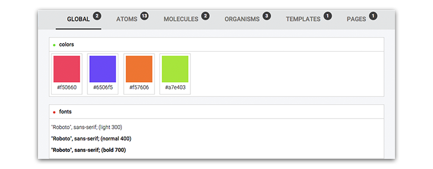

# 

> A simple and fast boirleplate that assists the development of Atomic Design Systems.

## Table of Contents
- [About atomic design](about-atomic-design)
- [About the miscroscope](about-the-miscroscope)
	- [What is it?](what-is-it?)
	-	[What does this do?](what-does-this-do?)
	-	[How to do?](how-to-do?)
- [Demo](demo)
- [Documentation](documentation)
- [Tips](tips)
	- [CSS Reset](css-reset)
	- [Semantic Grid](semantic-grid)
- [Contributing](contributing)
- [Credits](credits)
- [Licence](licence)

## About atomic design
- [Post](http://bradfrost.com/blog/post/atomic-web-design/) by Brad Frost.
- [Presentation](https://vimeo.com/109130093) by Brad Frost.
- [book](https://github.com/bradfrost/atomic-design/) by Brad Frost.

## About the miscroscope

**What is it?**

A simple and fast boirleplate that assists the development of Atomic Design Systems.

**What does this do?**

- Create and organize your atoms, molucules, organisms, templates and pages.
- Generate a Atomic Style guide.
- Build your Vanilla CSS UI framework based in your Atomic System.

**How to do?**

- [Jade](http://jade-lang.com/) as HTML template engine.
- Preprocessor the CSS with [Stylus](https://learnboost.github.io/stylus/).
- Build all with [GruntJS](http://gruntjs.com/).

## Demo
View a [demo](http://afonsopacifer.com/demos/microscope/) :)

## Documentation

See the [Docs page]().

## Tips

**CSS Reset**

In the [/public]() folder, we use the [normalize.css](http://necolas.github.io/normalize.css/) as reset through a [CDN](http://cdnjs.com/libraries/normalize).
Stay attend to it , so that the components are not different in their final application.

**Semantic Grid**

Integrating a Semantic Grid when creating your Organisms and Templates can be a good idea! As the microscope uses Stylus as preprocessor , we suggest the [Flex Grid Framework](http://flexgridframework.com/) for the function :)

## Contributing
If you found a bug, have any questions or want to contribute.
Go to [issues](), follow these [recommendations](CONTRIBUTING.md) and help us :)

## Credits
- Thanks to [Brad Frost](https://github.com/bradfrost) for having create this incredible methodology.
- Project inspired by [pattern lab](http://patternlab.io/).
- English revision by [Thalles Marchetti](https://github.com/linkmarchetti).

## Licence

[MIT Licence](LICENCE.md) © [Afonso Pacifer](https://github.com/afonsopacifer)
