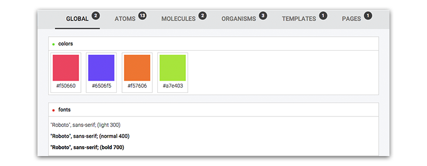

# 

> A simple and fast boilerplate that assists the development of Atomic Design Systems.

## Table of Contents

- [About atomic design](#about-atomic-design)
- [About the microscope](#about-the-microscope)
	- [What is it?](#what-is-it)
	-	[What does this do?](#what-does-this-do)
	-	[How to do?](#how-to-do)
- [Demo](#demo)
- [Documentation](#documentation)
- [Tips](#tips)
	- [CSS Reset](#css-reset)
	- [Semantic Grid](#semantic-grid)
- [Contributing](#contributing)
- [Credits](#credits)
- [Licence](#licence)

## About atomic design

- [Post](http://bradfrost.com/blog/post/atomic-web-design/) by Brad Frost.
- [Presentation](https://vimeo.com/109130093) by Brad Frost.
- [Book](https://github.com/bradfrost/atomic-design/) by Brad Frost.

## About the microscope

#### What is it?

A simple and fast boilerplate that assists the development of Atomic Design Systems.

#### What does this do?

- Create and organize your atoms, molecules, organisms, templates and pages.
- Generate an Atomic Style guide.
- Build your Vanilla CSS UI framework based on your Atomic System.

#### How to do?

- [Jade](http://jade-lang.com/) as the HTML template engine.
- Preprocess the CSS with [Stylus](https://learnboost.github.io/stylus/).
- Build everything with [GruntJS](http://gruntjs.com/).

## Demo

View a [demo](http://afonsopacifer.com/demos/microscope/) :)

## Documentation

- [Installation](docs/INSTALLATION.md)
- [Edit an existing component](docs/EDIT-AN-EXISTING-COMPONENT.md)
	- [Edit the component markup and style](docs/EDIT-AN-EXISTING-COMPONENT.m#edit-the-component-markup and-style)
	- [Edit the component states](docs/EDIT-AN-EXISTING-COMPONENT.m#edit-the-component-states)
	- [Edit the component notes](docs/EDIT-AN-EXISTING-COMPONENT.m#edit-the-component-notes)
	- [Edit the component name](docs/EDIT-AN-EXISTING-COMPONENT.m#edit-the-component-name)
	- [Reorder the components](docs/EDIT-AN-EXISTING-COMPONENT.m#reorder-the-components)
- [Create a component](docs/CREATE-A-COMPONENT.md)
- [Build your Atomic Style guide](docs/BUILD-YOUR-ATOMIC-STYLE-GUIDE.md)
- [Build your CSS UI framework](docs/BUILD-YOUR-CSS-UI-FRAMEWORK.md)
- [Grunt tasks list](docs/GRUNT-TASKS-LIST.md)
- [Folders structure](docs/FOLDERS-STRUCTURE.md)

## Tips

#### CSS Reset

In the [/public]() folder, we use the [normalize.css](http://necolas.github.io/normalize.css/) as a reset through a [CDN](http://cdnjs.com/libraries/normalize).
Stay attend to it, so that the components are not different in their final application.

#### Semantic Grid

Integrating a Semantic Grid when creating your Organisms and Templates can be a good idea! As the microscope uses Stylus as a preprocessor, we suggest the [Flex Grid Framework](http://flexgridframework.com/) for the functionality :)

## Contributing

If you found a bug, have any questions or want to contribute.
Go to [issues](issues), follow these [recommendations](CONTRIBUTING.md) and help us :)

## Credits

- Thanks to [Brad Frost](https://github.com/bradfrost) for creating this incredible methodology.
- Project inspired by [pattern lab](http://patternlab.io/).

## License

[MIT License](LICENSE.md) © [Afonso Pacifer](https://github.com/afonsopacifer)
