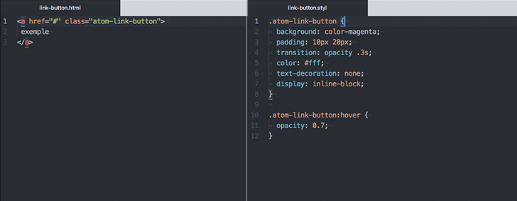
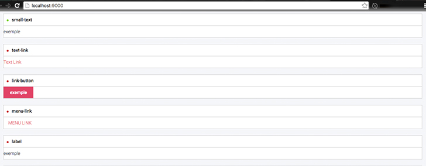
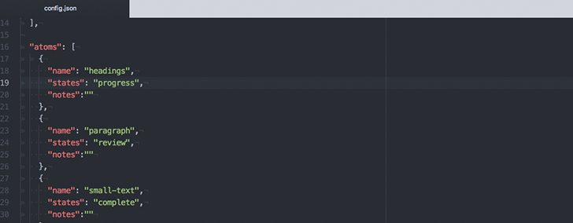
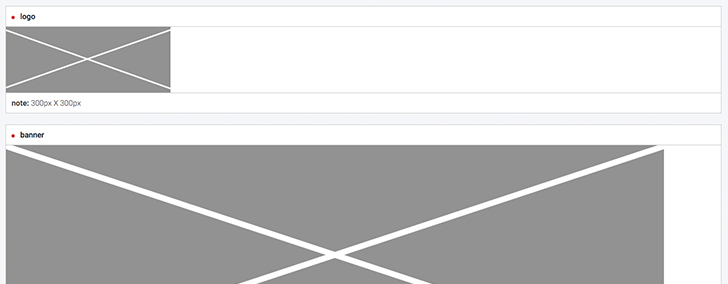

# Edit an existing component

**Note:** For example, let edit an atom in all examples.

- [Edit the component markup and style](#edit-the-component-markup and-style)
- [Edit the component states](#edit-the-component-states)
- [Edit the component notes](#edit-the-component-notes)
- [Edit the component name](#edit-the-component-name)
- [Reorder the components](#reorder-the-components)

## Edit the component markup and style

**1 - After Install the microscope, run the `grunt serve` command for watch for changes and build when necessary.**

[how to install?](INSTALLATION.md)

**2 - Open the Markup and Style folders:**

```
$ cd source/markup/atoms
```

```
$ cd source/style/atoms
```

**3 - Choice your atom, open in your favorite editor and edit.**



**4 - Save and view your change on http://localhost:9000/**



## Edit the component states

**1 - After Install the microscope, run the `grunt serve` command for watch for changes and build when necessary.**

[how to install?](INSTALLATION.md)

**2 - Open the config.json file:**



**3 - Choose the state of your component and edit the value of `states`**

```
{
	"name": "small-text",
	"states": "complete",
	"notes":""
},
```

**Note:** You have 3 levels to choose from `states`:

| Value        | Result           |
| ------------- |:-------------:|
| progress      |  |
| review      |  |
| complete      |  |

## Edit the component notes

**1 - After Install the microscope, run the `grunt serve` command for watch for changes and build when necessary.**

[how to install?](INSTALLATION.md)

**2 - Open the config.json file:**


**3 - Edit the `note` value:**

```
{
	"name": "logo",
	"states": "progress",
	"notes": "300px X 300px"
},
```
**4 - Save and view your change on http://localhost:9000/**



## Edit the component name

**1 - After Install the microscope, run the `grunt serve` command for watch for changes and build when necessary.**

[how to install?](INSTALLATION.md)

**2 - Edit the component name in the config.json file**


**2 - Edit the component name in yours markup/style files**

```
source/markup/atoms/menu-link.html
```

```
source/style/atomsmenu-link.html.style
```

**3 - Save and view your change on http://localhost:9000/**

## Reorder the components

**1 - After Install the microscope, run the `grunt serve` command for watch for changes and build when necessary.**

[how to install?](INSTALLATION.md)

**2 - Open the config.json file:**


**3 - Reorder the component**

```
{
  "name": "favicons",
  "states": "progress",
  "notes": ""
},
{
  "name": "logo",
  "states": "progress",
  "notes": "300px X 300px"
},
```

Reorder example:

```
{
  "name": "logo",
  "states": "progress",
  "notes": "300px X 300px"
},
{
  "name": "favicons",
  "states": "progress",
  "notes": ""
},
```

**4 - Save and view your change on http://localhost:9000/**
